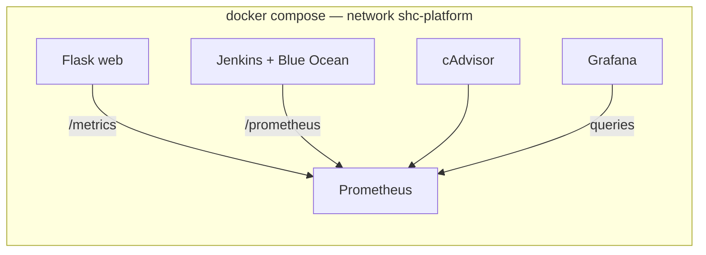

# Watchtower — Server Health Checker

A Flask-based monitoring dashboard for HTTP endpoints with SQLite history, Chart.js visualizations, and a **production-style DevOps stack**: **Jenkins** (with **Blue Ocean**), **Prometheus**, **Grafana**, **cAdvisor**, **Portainer**, and **Watchtower** — all wired with **Docker Compose**, persistent volumes, health checks, and a dedicated `shc-platform` network.

Repository layout is internship / submission friendly: application code at the repo root, infrastructure under `infra/`, and architecture docs under `docs/`.

## Features

- Add and remove monitored URLs (HTTPS recommended); on-demand and UI auto-refresh.
- **REST API** under `/api/*` and **`/metrics`** for Prometheus (request rates, latency histograms via `prometheus-flask-exporter`).
- **Docker** deployment with Gunicorn; **CI/CD** via Jenkins Pipeline (`Jenkinsfile`).
- **Observability**: Prometheus scrapes Flask, Jenkins, cAdvisor, and itself; Grafana ships with a provisioned **“SHC — Platform overview”** dashboard.
- **Operations**: Portainer (localhost-only bind), Watchtower (label-gated auto-updates).

## Project layout

```text
server-health-checker/
├── app.py                      # Flask app factory + routes
├── db.py, health_service.py
├── templates/, static/
├── tests/                      # pytest + conftest (CI import path)
├── pytest.ini
├── Dockerfile                  # App image (Gunicorn)
├── Dockerfile.jenkins          # Jenkins + Docker CLI + Blue Ocean + Prometheus plugin
├── docker-compose.yml          # Full DevOps stack (default entry point)
├── docker-compose.jenkins.yml  # Jenkins-only (optional)
├── Jenkinsfile                 # Declarative pipeline
├── requirements.txt
├── .env.example                # Grafana / optional env vars
├── infra/
│   ├── prometheus/prometheus.yml
│   └── grafana/
│       ├── dashboards/shc-overview.json
│       └── provisioning/     # datasources + dashboard loader
└── docs/
    ├── ARCHITECTURE.md         # Diagrams + ports + volumes
    └── JENKINS_CI_CD.md        # Jenkins + Windows socket notes
```

| Path | Role |
|------|------|
| `app.py` | Flask app factory; `/metrics` for Prometheus |
| `Dockerfile` | App image |
| `docker-compose.yml` | **Full stack** — see table below |
| `infra/prometheus/prometheus.yml` | Scrape jobs: prometheus, cadvisor, flask, jenkins |
| `infra/grafana/...` | Auto-load Prometheus datasource + dashboards |

## Quick start (local Python)

```bash
python -m venv .venv
.venv\Scripts\activate          # Windows
# source .venv/bin/activate       # macOS / Linux
pip install -r requirements.txt
python app.py
```

Open [http://127.0.0.1:5000](http://127.0.0.1:5000).

## Full DevOps stack (Docker Compose)

### Prerequisites

- **Docker Desktop** (Windows/macOS) or Docker Engine (Linux) with Compose v2.
- **4 GB+ RAM** free recommended (Jenkins + Grafana + Prometheus together).

### One command

From the repository root:

```powershell
# Optional: fix Jenkins → host Docker permission (Docker Desktop / many Linux setups)
$env:DOCKER_SOCK_GID = (docker run --rm -v //var/run/docker.sock:/var/run/docker.sock alpine stat -c '%g' /var/run/docker.sock)

# Optional: copy .env and set a strong Grafana password
# copy .env.example .env

docker compose up -d --build
```

### URLs (host)

| Service | URL | Notes |
|---------|-----|--------|
| **Flask app** | [http://localhost:5000](http://localhost:5000) | Main product |
| **Jenkins** | [http://localhost:9090](http://localhost:9090) | First-run unlock: `docker exec shc-jenkins cat /var/jenkins_home/secrets/initialAdminPassword` |
| **Blue Ocean** | [http://localhost:9090/blue](http://localhost:9090/blue) | Pre-installed via `Dockerfile.jenkins` |
| **Grafana** | [http://localhost:3000](http://localhost:3000) | Default `admin` / `admin` unless overridden in `.env` |
| **Prometheus** | [http://localhost:9091](http://localhost:9091) | UI on host **9091** (container 9090) |
| **cAdvisor** | [http://localhost:8081](http://localhost:8081) | Per-container CPU/memory |
| **Portainer** | [http://127.0.0.1:8999](http://127.0.0.1:8999) | **Bound to localhost** for safer exposure |

### Architecture (summary)



Full diagram, ports, and volume names: **[docs/ARCHITECTURE.md](docs/ARCHITECTURE.md)**.

### Jenkins metrics in Prometheus

The custom Jenkins image installs the **Prometheus metrics** plugin. After Jenkins is configured:

1. **Manage Jenkins → Configure System → Prometheus**: ensure the metrics path is enabled (default **`/prometheus`**).
2. If scrapes return **403**, allow read access for the metrics endpoint or add **basic auth** to `infra/prometheus/prometheus.yml` (documented in comments there).

### Grafana dashboards

On first Grafana login, open **Dashboards → SHC Platform → SHC — Platform overview**. Panels include:

- Scrape health for **Flask**, **Jenkins**, **cAdvisor**
- Flask **request rate** and **p95 latency**
- Container **CPU** and **memory** by Compose service name
- **Jenkins queue / executors** (when the Prometheus plugin exposes `jenkins_*` metrics)

### Watchtower (auto-updates)

- `WATCHTOWER_LABEL_ENABLE=true` — only containers with **`com.centurylinklabs.watchtower.enable=true`** are updated.
- **Jenkins** is **not** labeled (avoid surprise upgrades of CI).
- Default schedule: **daily at 03:00** (`WATCHTOWER_SCHEDULE`).

### Portainer (safe exposure)

The UI is published as **`127.0.0.1:8999:9000`** so it is not reachable from other machines on the LAN by default. For remote access, use a VPN, SSH tunnel, or a reverse proxy with authentication — do not expose Portainer raw to the internet.

### Application-only compose (lightweight)

To run **only the Flask service** (no Jenkins/monitoring):

```bash
docker compose up -d web
```

(Other services stay defined but stopped.)

### Jenkins-only (legacy path)

```bash
docker compose -f docker-compose.jenkins.yml up -d --build
```

Prefer the unified **`docker-compose.yml`** for demos.

## CI/CD (Jenkins Pipeline)

- Pipeline definition: **`Jenkinsfile`** (checkout → dependencies → tests → Docker check → build image).
- Create a **Pipeline** job from SCM pointing at this repo; install **JUnit** plugin for test reports.
- Details: **[docs/JENKINS_CI_CD.md](docs/JENKINS_CI_CD.md)**.

## Environment variables

| Variable | Purpose |
|----------|---------|
| `PORT` | Dev server port (default `5000`) |
| `DATABASE_PATH` | SQLite file path (Compose uses `/data/healthchecker.db`) |
| `PROMETHEUS_MULTIPROC_DIR` | Gunicorn multi-worker Prometheus metrics dir (set in `Dockerfile`) |
| `GRAFANA_*` | See **`.env.example`** |

## REST API

| Method | Path | Description |
|--------|------|-------------|
| `GET` | `/api/health` | Liveness JSON for probes |
| `GET` | `/api/stats` | Aggregate counts |
| `GET` | `/api/servers` | List servers |
| `POST` | `/api/servers` | Add server `{"name","url"}` |
| `DELETE` | `/api/servers/<id>` | Remove server |
| `POST` | `/api/servers/<id>/check` | Run one check |
| `POST` | `/api/check-all` | Check all servers |
| `GET` | `/api/servers/<id>/history` | Time series for charts |
| `GET` | `/metrics` | **Prometheus** metrics (text exposition) |

## Docker (application image only)

```bash
docker build -t server-health-checker-web:latest .
docker run -p 5000:5000 -e DATABASE_PATH=/data/healthchecker.db -v shc-data:/data server-health-checker-web:latest
```

## Production-style serve (inside image)

```bash
gunicorn --bind 0.0.0.0:5000 --workers 2 --threads 4 app:app
```

## Tests

```bash
pip install -r requirements.txt
pytest -v
```

## License

Use and modify freely for learning and internal tooling.
