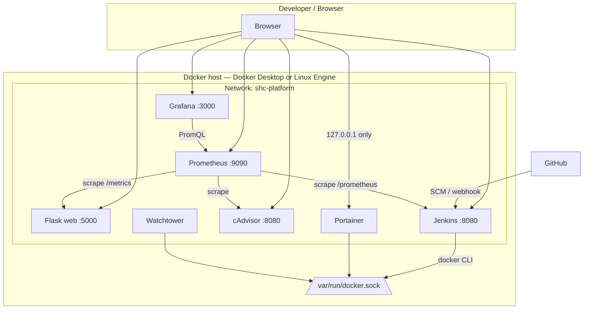

# Architecture — Server Health Checker DevOps stack

This document describes the **full Docker Compose platform**: Flask app, Jenkins CI, Prometheus, Grafana, cAdvisor, Portainer, and Watchtower.

## High-level diagram



## Data flow

| Path | Description |
|------|-------------|
| **Metrics** | Prometheus pulls **Flask** (`/metrics` via `prometheus-flask-exporter`), **Jenkins** (`/prometheus` via Prometheus plugin), **cAdvisor** (container cgroup stats), and itself. |
| **Dashboards** | Grafana uses the **Prometheus** datasource (provisioned) and loads JSON dashboards from `infra/grafana/dashboards/`. |
| **CI** | Jenkins builds the Flask image using the mounted **Docker socket** (same engine as the host). |
| **Updates** | **Watchtower** polls registries on a schedule and recreates **labeled** containers (Jenkins is excluded by default). |
| **Operations** | **Portainer** talks to the host engine via **docker.sock**; HTTP UI is bound to **127.0.0.1** to reduce exposure. |

## Ports (host)

| Service | Host port | Notes |
|---------|-----------|--------|
| Flask | 5000 | Public app |
| Jenkins | 9090 → 8080 | Blue Ocean: `/blue` |
| Grafana | 3000 | Change default password |
| Prometheus | 9091 → 9090 | Avoids clash with Jenkins URL habit |
| cAdvisor | 8081 → 8080 | Container metrics UI |
| Portainer | 127.0.0.1:8999 | HTTP UI (localhost only) |
| Jenkins agents | 50000 | Inbound agents |

## Volumes

| Volume | Purpose |
|--------|---------|
| `shc_sqlite_data` | Flask SQLite database |
| `shc_jenkins_home` | Jenkins config, plugins, jobs |
| `shc_prometheus_data` | TSDB retention |
| `shc_grafana_data` | Grafana DB, users, preferences |
| `shc_portainer_data` | Portainer configuration |

## Security notes (submission / lab)

- Change **Grafana** and **Jenkins** passwords immediately after first login.
- **Portainer** controls the full engine; keep it on **localhost** or behind a VPN/reverse proxy with auth.
- Mounting **docker.sock** into Jenkins (and Portainer) is equivalent to **root on the host** for Docker operations—treat job permissions and credentials accordingly.
- **Watchtower** auto-updates can break pinned environments; only containers with `com.centurylinklabs.watchtower.enable=true` are updated when `WATCHTOWER_LABEL_ENABLE=true`.

## Repository layout

```text
server-health-checker/
├── app.py
├── docker-compose.yml          # Full stack
├── docker-compose.jenkins.yml  # Jenkins-only shortcut
├── Dockerfile
├── Dockerfile.jenkins
├── infra/
│   ├── prometheus/prometheus.yml
│   └── grafana/
│       ├── dashboards/
│       └── provisioning/
├── docs/
│   ├── ARCHITECTURE.md         # This file
│   └── JENKINS_CI_CD.md
└── Jenkinsfile
```
