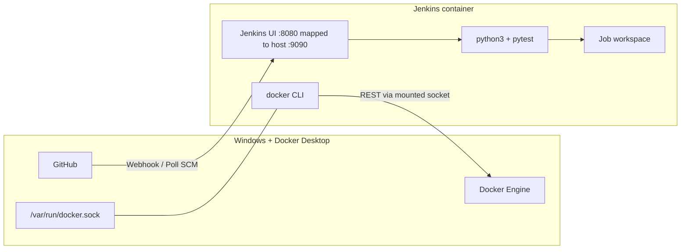

# Jenkins in Docker on Windows — CI/CD for **server-health-checker**

This guide matches the files in this repository:

| File | Purpose |
|------|---------|
| `Dockerfile.jenkins` | Custom Jenkins image: Docker CLI + Python + **Blue Ocean** + **Prometheus metrics** plugin + Pipeline essentials |
| `docker-compose.yml` | **Preferred**: full stack on network `shc-platform` (Jenkins + observability + Portainer + Watchtower) |
| `docker-compose.jenkins.yml` | Jenkins-only: ports **9090** / **50000**, `jenkins_home` volume, `docker.sock` mount |
| `Jenkinsfile` | Pipeline: Checkout → Install Dependencies → Run Tests → Docker Check → Docker Build (strict `set -eu`, no `|| true`) |
| `pytest.ini` / `tests/conftest.py` | Repo root on import path (`from app import …` in CI) |

Repository: [https://github.com/harshitha-sn/server-health-checker.git](https://github.com/harshitha-sn/server-health-checker.git)

---

## Architecture



- Jenkins **does not** run a nested Docker daemon by default; the **`docker` CLI** inside the container talks to **Docker Desktop’s daemon** through the mounted socket.
- Your **app image** is built on the **same** Docker Desktop engine, so images appear in `docker images` on the host.

---

## Folder layout (what you care about)

```text
server-health-checker/
├── Dockerfile                 # App image (Flask + gunicorn)
├── Dockerfile.jenkins         # Jenkins controller image
├── docker-compose.jenkins.yml # Run Jenkins with volumes + socket
├── Jenkinsfile                # Declarative pipeline
├── requirements.txt           # Includes pytest for local dev too
├── docs/
│   └── JENKINS_CI_CD.md       # This file
└── ...
```

---

## 1. Build the Jenkins image

From the repository root (`server-health-checker`):

```powershell
docker build -f Dockerfile.jenkins -t server-health-checker-jenkins:lts .
```

---

## 2. Run Jenkins (recommended: Docker Compose)

### Set `DOCKER_SOCK_GID` once (avoids **permission denied** on `docker.sock`)

**PowerShell** (copy as one block):

```powershell
$env:DOCKER_SOCK_GID = (docker run --rm -v //var/run/docker.sock:/var/run/docker.sock alpine stat -c '%g' /var/run/docker.sock)
docker compose -f docker-compose.jenkins.yml up -d --build
```

If you skip this, Compose still uses default `${DOCKER_SOCK_GID:-999}` from `docker-compose.jenkins.yml`; if `docker version` fails in a job, re-run the `stat` line and export again, then `docker compose ... up -d`.

### Open Jenkins

- UI: **http://localhost:9090** (host **9090** → container **8080**)
- **Blue Ocean**: **http://localhost:9090/blue** (installed at image build time via `jenkins-plugin-cli`)
- Agent port: **50000** (for inbound agents; not required for simple `agent any` on the controller)

### Prometheus scrape (`/prometheus`)

After unlocking Jenkins, confirm **Manage Jenkins → Configure System → Prometheus** exposes metrics (default path **`/prometheus`**). Prometheus in `infra/prometheus/prometheus.yml` scrapes **`jenkins:8080`**. If the target stays down, check authentication (allow metrics read or add `basic_auth` to the scrape config).

### First-time unlock

```powershell
docker exec jenkins-server-health-checker cat /var/jenkins_home/secrets/initialAdminPassword
```

Complete the setup wizard and install suggested plugins (see **Plugins** below).

---

## 3. Equivalent `docker run` (no Compose)

**PowerShell** — line continuation uses the **backtick** `` ` `` (not `^`):

```powershell
$gid = (docker run --rm -v //var/run/docker.sock:/var/run/docker.sock alpine stat -c '%g' /var/run/docker.sock)

docker run -d `
  --name jenkins-server-health-checker `
  --restart unless-stopped `
  -p 9090:8080 `
  -p 50000:50000 `
  -v jenkins_server_health_checker_home:/var/jenkins_home `
  -v //var/run/docker.sock:/var/run/docker.sock `
  --group-add $gid `
  server-health-checker-jenkins:lts
```

**Command Prompt (cmd.exe)** — line continuation uses **`^`** at the **end of each line** (no character after `^` except newline):

```cmd
FOR /F %i IN ('docker run --rm -v //var/run/docker.sock:/var/run/docker.sock alpine stat -c "%%g" /var/run/docker.sock') DO SET DOCKER_SOCK_GID=%i

docker run -d ^
  --name jenkins-server-health-checker ^
  --restart unless-stopped ^
  -p 9090:8080 ^
  -p 50000:50000 ^
  -v jenkins_server_health_checker_home:/var/jenkins_home ^
  -v //var/run/docker.sock:/var/run/docker.sock ^
  --group-add %DOCKER_SOCK_GID% ^
  server-health-checker-jenkins:lts
```

> **When to use `^` (cmd)** vs **backticks (PowerShell)**  
> - **`cmd.exe`**: only `^` continues a line.  
> - **PowerShell**: use `` ` `` at end of line; `^` is not line continuation.  
> - **One-line commands**: use when pasting into docs is awkward or when scripting without continuations — functionally the same Docker CLI.

---

## 4. GitHub → Jenkins job

1. **New Item** → Pipeline (or Multibranch Pipeline).
2. **Pipeline from SCM** → Git → URL: `https://github.com/harshitha-sn/server-health-checker.git`
3. Branch: `main` (or your default).
4. **Script Path**: `Jenkinsfile`
5. Credentials: add if the repo is private (Username + PAT, or SSH key in Jenkins).

Run **Build Now** and confirm stages go green.

---

## 5. Verify tools *inside* the Jenkins container

```powershell
docker exec -it jenkins-server-health-checker docker version
docker exec -it jenkins-server-health-checker python3 --version
docker exec -it jenkins-server-health-checker python3 -m pytest --version
docker exec -it jenkins-server-health-checker git --version
```

If `docker version` fails here, fix **socket GID** (`--group-add` / `DOCKER_SOCK_GID`) before debugging the pipeline.

---

## 6. Rebuild Jenkins safely (keep data)

Named volume **`jenkins_server_health_checker_home`** holds jobs, plugins, secrets.

```powershell
docker compose -f docker-compose.jenkins.yml build --no-cache
docker compose -f docker-compose.jenkins.yml up -d
```

Data is kept unless you remove the volume:

```powershell
# Destructive — only if you intend to wipe Jenkins completely
docker compose -f docker-compose.jenkins.yml down -v
```

---

## 7. Restart Jenkins

```powershell
docker restart jenkins-server-health-checker
```

Or with Compose:

```powershell
docker compose -f docker-compose.jenkins.yml restart
```

---

## 8. Troubleshooting

| Symptom | Likely cause | Fix |
|--------|----------------|-----|
| **`docker: not found`** in job | Jenkins image lacks CLI, or PATH issue | Rebuild `Dockerfile.jenkins`; `docker exec ... which docker` |
| **`permission denied`** on `/var/run/docker.sock` | GID mismatch | Set `DOCKER_SOCK_GID` / `--group-add` to socket’s group (see §2, §3) |
| **`invalid reference format`** on `docker build -t` | Bad tag characters / empty name | This repo uses `server-health-checker:${BUILD_NUMBER}` (lowercase, safe) |
| **`pytest` / `python3` not found** | Wrong image or custom entrypoint | Rebuild `Dockerfile.jenkins`; verify with §5 |
| **Plugins missing** | Fresh Jenkins | Install **Pipeline**, **Git**, **JUnit**, **Docker Pipeline** (optional) |
| **Docker daemon not running** (host) | Docker Desktop stopped | Start Docker Desktop; `docker version` on **Windows** should work first |
| **Pipeline `junit` step fails** | Plugin not installed | Install **JUnit** plugin, or temporarily remove `junit` from `Jenkinsfile` |

---

## 9. Recommended Jenkins plugins (this project)

- **Pipeline** — Declarative Pipeline support  
- **Git** — SCM checkout  
- **JUnit** — publishes `test-results.xml` from pytest  
- **GitHub** — GitHub integration (hooks, status)  
- **Docker Pipeline** (`docker { image ... }`) — optional if you later move builds into agents  
- **Blue Ocean** — optional nicer UI  
- **Credentials Binding** — safer secrets in pipelines  

---

## 10. Future upgrades

| Idea | Benefit |
|------|---------|
| **GitHub webhooks** | Instant builds on push; no polling delay |
| **Watchtower** | Auto-pull newer `:lts` Jenkins or app images (use with care in prod) |
| **Prometheus + Grafana** | Metrics on build times, queue length, executor usage |
| **Push to Docker Hub / GHCR** | `docker login` in Jenkins credentials + `docker push` stage |
| **Slack / email** | `post { failure { slackSend ... } }` for alerts |
| **Separate build agents** | Heavy builds off the controller; controller stays responsive |

---

## 11. Why the old pipeline “passed” but was broken

Using `|| true` after `python3`, `pip3`, `pytest`, or `docker` **hides failures** and marks the stage green. The production `Jenkinsfile` uses `set -e` so real CI failures fail the build.

---

## 12. Security notes (production)

- Prefer **least privilege** credentials and GitHub **fine-grained PATs** or GitHub Apps.  
- Do not expose Jenkins to the public internet without **TLS**, auth hardening, and network controls.  
- Mounting `docker.sock` grants **root-equivalent on the host** to anything that can run `docker` inside the container — restrict who can create jobs and run scripts.

---

## Quick reference: Windows Docker socket path

Use **double slash** for the socket on Docker Desktop:

`-v //var/run/docker.sock:/var/run/docker.sock`

This avoids path translation issues from Windows to the Linux VM.
